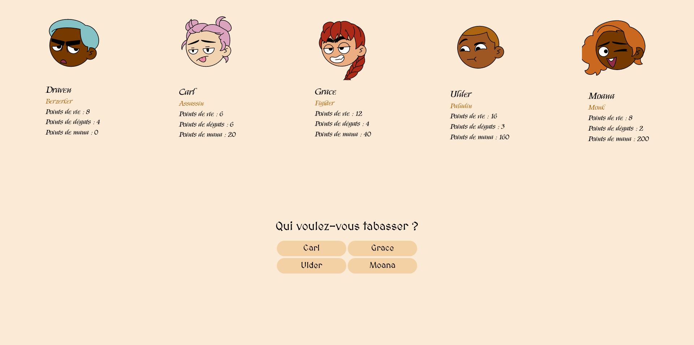

# MEUPORG 👾

[Pitch du projet](#pitch-du-projet) | 
[Live Site et Screenshot](#live-site-et-screenshot) | 
[Features](#features) | 
[Crédits et remerciements](#crédits-et-remerciements)

RPG de **bagarre** fait en JS, codé pour THP

## Pitch du projet

Nous allons faire un jeu où le joueur pourra contrôler 5 personnages qui vont se combattre à mort, façon gladiateurs. Chaque personnage aura des caractéristiques qui lui sont propres.

Chaque tour, pour chaque personnage, tu vas choisir qui attaquer. Le personnage qui a le plus de points de vie à la fin de 10 tours a gagné le jeu !

## Live Site et Screenshot

[Clique ici pour voir le site !](https://beygs.github.io/meuporg/)

## Features

- Cinq classes de personnages
- Attaques classiques et attaques spéciales
- Bagarre de qualité

## Crédits et remerciements

Merci à [The Hacking Project](https://www.thehackingproject.org/) et à tous les moussaillons pour cette formation de qualité !
